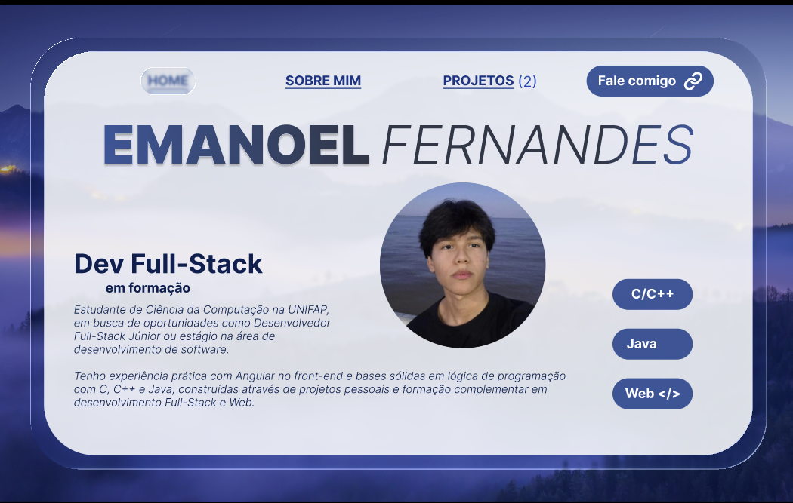
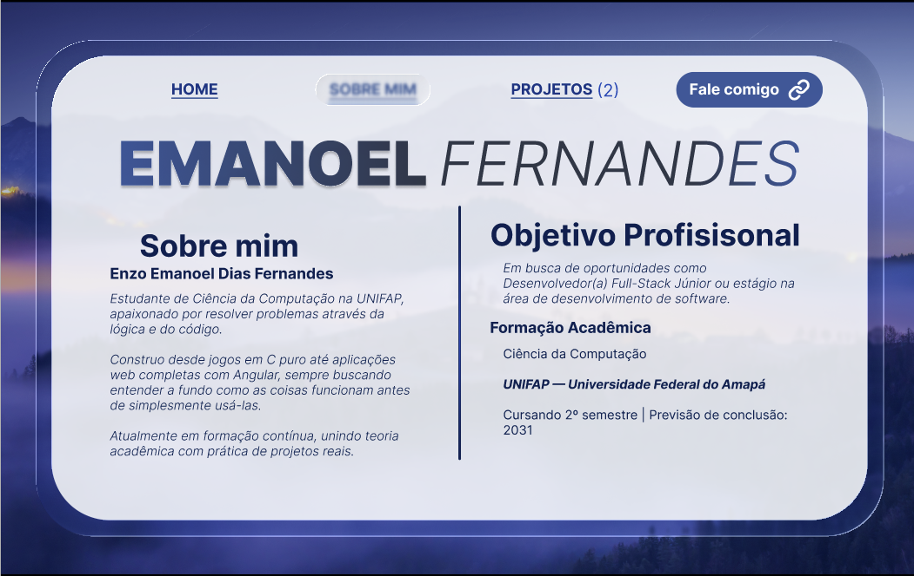
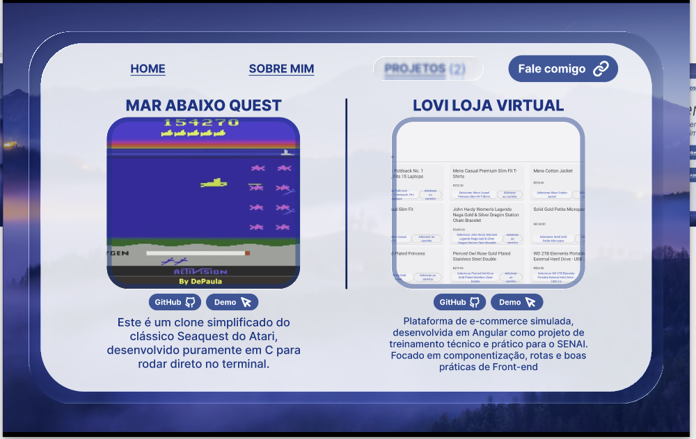
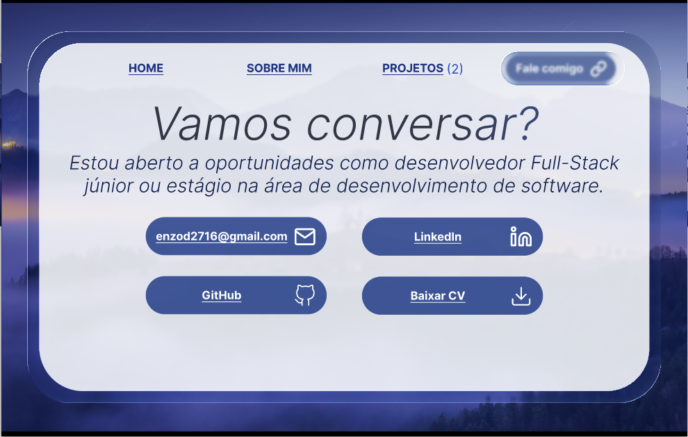

# Protótipo de Portfólio Profissional

## Link do Figma
[Acessar o protótipo no Figma](https://www.figma.com/design/AvrrWkKFQ70Dr8oekmQ7p3/PR%C3%89-PORTF%C3%93LIO?t=ERNFtAkBYh0VLYpT-1)

## Capturas de Tela / Imagens
*Substitua os caminhos abaixo pelas imagens exportadas das suas 3 telas do protótipo:*

> **Tela 1:** Home

> **Tela 2:** Sobre Mim

> **Tela 3:** Projetos

> **Tela 4:** Contato)

## Ferramentas Utilizadas
* **Figma**
* **GitHub**

## Autoria
**Enzo Emanoel Dias Fernandes**
* [GitHub](https://github.com/emnlfrnds)
